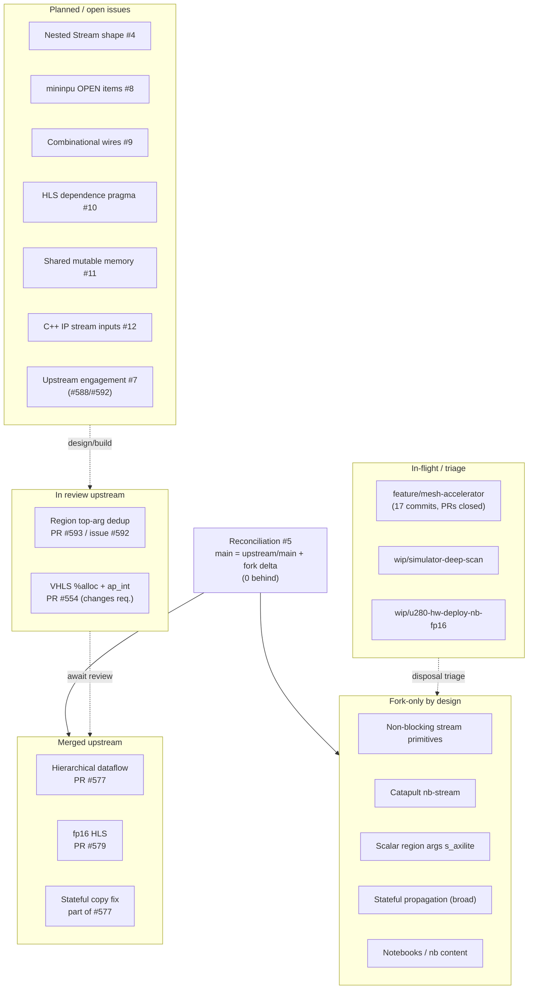

# Upstream feature map: one-picture fork vs upstream status

**Date:** 2026-07-15
**Scope:** the single feature-level map of everything `sunwookim028/allo`
(`origin`) carries relative to `cornell-zhang/allo` (`upstream`). It synthesizes
`notes/`, fork issues #4-#12, and upstream PRs/issues into one table plus a
status-lane diagram.

This doc is a snapshot. To regenerate or verify, run the status-check procedure
(skill: `/status-check`) and judge live state from git/GitHub, not from this
file:

```
git branch -vv
git rev-list --left-right --count main...upstream/main
gh pr list -R cornell-zhang/allo
gh issue list -R sunwookim028/allo --state all
git diff --stat upstream/main..main -- '*.py' '*.cpp' '*.h' '*.td'
```

As of the last reconciliation (`ffa2d0c`), local/origin `main` contains all of
`upstream/main` (baseline `437bf53`) plus the fork-local delta (61 commits
ahead, 0 behind). Upstream PRs #594, #586, #577, #579 are absorbed.

## The one-picture summary table

| Feature / workstream | What it is (1 line) | Where it lives | Upstream status | Tracking | Next action |
| --- | --- | --- | --- | --- | --- |
| Stateful region propagation | Region-scope `@Stateful` shared state survives `ASTContext.copy()` and propagates to inner kernels | `allo/ir/visitor.py` (fork-local block, kept byte-identical across `ffa2d0c`); `allo/ir/builder.py`, `allo/ir/infer.py` | Partly merged: the `global_op_cache`-on-copy fix landed via PR #577 (MERGED 2026-05-13). Fork keeps a broader stateful-propagation block not upstreamed | fork #5 (preserve in reconcile); upstream #565 (closed via #577) | Keep fork-local; decide which generic slice is upstreamable |
| Scalar region args (s_axilite / m_axi) | Bare `int32` region arg -> `s_axilite` AXI-Lite scalar port; `int32[N]` -> `m_axi` pointer | `allo/dataflow.py` (`_build_top`), `allo/backend/vitis.py` (`postprocess_hls_code`), `allo/backend/llvm.py` (`__call__`); test `tests/dataflow/test_df_unit.py::test_region_bare_scalar_arg` | Not submitted (fork-only). The #577 review rejected scalars in `args=[...]`; auto-capture `s_axilite` redesign is deferred upstream | upstream #577 review; fork #7 face 4 | Hold for auto-capture redesign; workaround `int32[1]` as `m_axi` documented |
| Hierarchical dataflow (simulator + HLS) | Recursive OMP parallel-sections so inner-region stream kernels do not deadlock; forward decls + dataflow pragma in HLS codegen | `allo/backend/simulator.py`, `allo/ir/builder.py`, `mlir/lib/Translation/*` | Merged: PR #577 (MERGED 2026-05-13, closes #561/#565). Superseded closed drafts #562, #563 | upstream #561, #565; fork #7 | Done upstream; remaining faces tracked in fork #7 |
| fp16 (half) HLS support | `float16` scalar math lowering + `hls::`-namespaced half math overloads in Vitis HLS emitter | `allo/ir/builder.py`, `mlir/lib/Translation/EmitVivadoHLS.cpp` | Merged: PR #579 (MERGED 2026-05-11). Superseded closed draft #578 | upstream #478 (part 3) | Done upstream |
| VHLS `%alloc` strip + ap_int nanobind | Strip MLIR `%`-SSA sigil from emitted VHLS csim; fix `parse_cpp_function` to match `ap_int<N>` | `allo/backend/vitis.py` (`postprocess_hls_code`), `allo/backend/ip.py` | Open PR #554 (OPEN, changes-requested). Reviewer follow-ups pending on reviewer side | upstream PR #554 | Await reviewer; address follow-ups when they land |
| Region top-arg aliasing dedup | Dedup top-level region args by DTensor `top_name` (bound name) not kernel-local param name, so same-named inputs do not alias | `allo/dataflow.py` (`_build_top`), `allo/ir/infer.py` (`top_name`); test `tests/dataflow/test_region_toparg_aliasing.py` | Open PR #593 (OPEN) | upstream issue #592; upstream PR #593 | Await review/merge |
| Simulator nested-call deep-scan | WIP: deep-scan nested `func.call` ops in `_process_function_streams` | branch `wip/simulator-deep-scan` (1 WIP commit); origin mirror exists | Not submitted (WIP) | (branch triage) | Triage pending: land, fold, or drop |
| Mesh accelerator | Hierarchical / decoupled 2D-mesh accelerator experiments and perf harness | branch `feature/mesh-accelerator` (17 unique commits; PRs closed unmerged); tests `test_hierachical_mesh.py`, `test_decoupled_mesh.py`, `hls_synth_decoupled.py`, `mesh_perf.py` | Closed unmerged upstream | fork #7 (design); fork #4 (nested-stream blocker) | Triage pending: rebase, fold, or archive |
| u280 hw-deploy / nb / fp16 rescue | Rescue commit: U280 hardware-deploy notebooks + nb-stream patterns + fp16 synth tests | branch `origin/wip/u280-hw-deploy-nb-fp16` (1 rescue commit) | Not submitted (rescue) | (branch triage) | Triage pending: extract useful pieces, then dispose |
| Non-blocking stream primitives | `try_put`/`try_get`/`empty`/`full` DSL + `StreamTry*` MLIR ops + VHLS/Catapult/sim lowering | `allo/ir/types.py`, `allo/ir/builder.py`, `allo/dataflow.py`, `allo/backend/simulator.py`, `AlloOps.td`, `Visitor.h`, `EmitVivadoHLS.cpp`; tests `test_stream_ops_*.py`; doc `docs/.../nonblocking_streams.rst` | Fork-only by design | fork #5 (preserve) | Keep fork-local |
| Catapult nb-stream support | Non-blocking-stream emitters on the (already-upstream) Catapult backend, using `ac_channel::available()` | `allo/backend/catapult.py`, `mlir/lib/Translation/EmitCatapultHLS.cpp`; `notes/CATAPULT_QUICKSTART.md` | Fork-only by design (backend exists upstream; nb-stream delta does not) | fork #5 (preserve) | Keep fork-local |
| Notebook / nb fork-local content | Fork-local U280/HW-deploy notebooks and nb-stream demo content | fork `main` only (nb/notebook files) | Fork-only by design | fork #5 | Keep fork-local |
| Nested sub-region Stream shape | Bug: nested sub-region `Stream` requires compile-time-constant array shape; blocks compute-tile composition | (blocker surfaced in mininpu fold-in) | Not submitted (open bug) | fork #4 | Support non-constant nested Stream shapes, or document required pattern |
| mininpu integration OPEN items | Preserve allo-side handoff items: ISA lockstep, tree reorg, `#import(HLS/RTL)`, `#to` routing, host-runtime pivot to C/C++ | (design/decision items, no code yet) | Fork-only planning | fork #8 | Decide/design each item; then delete parent handoff doc |
| Combinational wires in region | Feature request: wire (not FIFO/Stream) connection between kernels in a region | (not implemented) | Not submitted (feature request) | fork #9 | Design wire connection at dataflow level |
| HLS dependence pragma | Feature request: auto-generate `#pragma HLS dependence` | (not implemented) | Not submitted (feature request) | fork #10 | Implement pragma emission |
| Shared mutable memory across kernels | Feature request: module-level array shared across region kernels (today rejected at `infer.py:172`) | (not implemented) | Not submitted (feature request) | fork #11; relates to fork #7 face 3 | Design shared region-scope buffer; back-end static-array mis-compile is fork #7 face 3 |
| Streams as C++ IP top-level inputs | Feature request: support `hls::stream<>&` as top-level input when integrating a C++ IP module | (not implemented) | Not submitted (feature request) | fork #12 | Support stream top-level inputs / auto-wrapper generation |
| Upstream hierarchical-dataflow engagement | Held draft comment for #588 + a held hierarchical-dataflow design discussion (4 faces, one root cause) | `notes/HIERARCHY_DESIGN.md`; fork #7 body | Not yet posted upstream | fork #7; upstream #588, #592, #524, #561, #565 | Post held item 1 to #588 (soften repro wording), then pick discussion venue |
| main <-> upstream reconciliation | Keep fork `main` reconciled with `upstream/main` while preserving fork-local features | `notes/FORK_LOCAL_FEATURES.md` (inventory), `notes/MAINTENANCE_CHECKLIST.md` (procedure) | Done for the current baseline (`ffa2d0c`: 0 behind `upstream/main`); recurring | fork #5 | Re-run on each upstream merge per checklist |

Notes on upstream issues the fork tracks: #588 ([Bug][Builder] hierarchical
dataflow: IndentationError on region-in-kernel, and symbol redefinition on
region reuse) and #592 (top-level arg aliasing by kernel-local name, fixed by
PR #593).

## One-picture diagram



## How this relates to the other docs

- `notes/FORK_LOCAL_FEATURES.md` = file-level inventory (which `.py`/`.cpp`/
  `.h`/`.td`/test files are fork-local, for reconciliation preservation).
- `notes/MAINTENANCE_CHECKLIST.md` = the merge procedure (what to do when an
  upstream PR merges).
- `notes/PITFALLS_DATAFLOW_REGION.md` = specific bugs/pitfalls in the region
  and scalar-arg paths.
- `notes/HIERARCHY_DESIGN.md` = the governing hierarchical-HLS design anchor.
- This doc (`UPSTREAM_FEATURE_MAP.md`) = the feature-level map: one row per
  workstream and its upstream status. Use it as the entry point; drill into the
  above for file-level or procedural detail.
